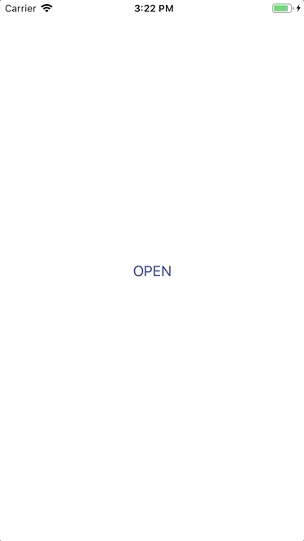

[DEPRECEATED] Since iOS13 this is build-int feature

#  Simple Interactive Transitions using UIViewPropertyAnimator

Since iOS10 UIViewPropertyAnimator gives us an amazing tool to make UIView animations interactive.
this project is simple experiment, feel free to extend and customize - it is very simple!

1. Copy `InteractiveDismissing` class to your project
2. Conform ypour modal viewciontroller to the `InteractiveDismissing` protocol
```
var animator: UIViewPropertyAnimator?
```

3. Add `UIPanGestureRecognizer` to your view 

```
let panGesture = UIPanGestureRecognizer(target: self, action: #selector(ModalViewController.didTrackPanGesture))
view.addGestureRecognizer(panGesture)
```

5. In your gesture handler simply call:  
```
dismissInteractively(with: sender) {
	self.dismiss(animated: false, completion: nil)
}
```

6. __Done.__




